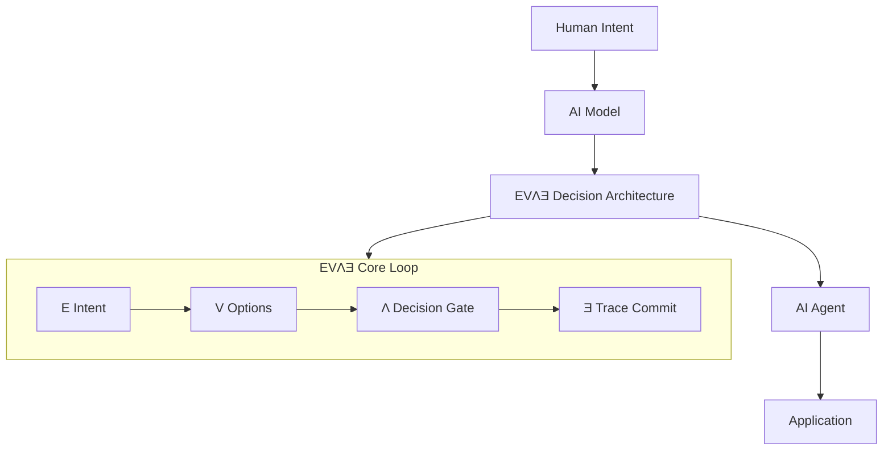

# EVΛƎ — Decision Architecture for AI Systems

[](#about)
[](#ev%CE%BB%C6%8E-core-loop)
[](#reference-implementation)

*Design‑by‑Transparency for AI decision systems.*

**AI Decision OS**

EVΛƎ (Eva) is a structural decision architecture designed to organize AI decisions **before execution**.

Most AI systems attempt to explain decisions **after they occur**. EVΛƎ instead structures the decision process itself and commits the reasoning as a trace, ensuring that responsibility and reasoning are defined before execution.

This repository provides a **reference implementation of the EVΛƎ Conscious Loop**, the foundational layer of the EVΛƎ architecture.

---

# EVΛƎ Decision OS Concept

EVΛƎ introduces a new architectural layer within AI systems.

Instead of allowing model outputs to trigger actions directly, EVΛƎ inserts a **decision architecture layer** between the model and execution.

## EVΛƎ Architecture Diagram



## EVΛƎ OS Architecture

```text
┌────────────────────┐
│ Human Intent       │
└─────────┬──────────┘
          ↓
┌────────────────────┐
│ AI Model           │
└─────────┬──────────┘
          ↓
╔════════════════════╗
║ EVΛƎ Decision      ║
║ Architecture       ║
║                    ║
║ E → V → Λ → Ǝ      ║
╚═════════╤══════════╝
          ↓
┌────────────────────┐
│ AI Agent           │
└─────────┬──────────┘
          ↓
┌────────────────────┐
│ Application        │
└────────────────────┘
```

### System Perspective

```text
Traditional AI
Input → Model → Output

EVΛƎ-Based AI
Intent → Model → EVΛƎ Decision Architecture → Agent → Action
```

EVΛƎ records and structures the elements required for responsible AI decision-making:

* origin of intent
* generated options
* decision gate conditions
* traceable outcomes

This transforms AI execution from a **black box process** into a **structured decision system**.

---

# EVΛƎ Core Loop

The minimal EVΛƎ structure is the **Conscious Loop**.

```
E → V → Λ → Ǝ
```

| Symbol | Meaning          |
| ------ | ---------------- |
| **E**  | Intent           |
| **V**  | Possible Options |
| **Λ**  | Decision Gate    |
| **Ǝ**  | Trace Commit     |

Decision flow:

```
Intent → Options → Decision → Trace
```

This structure ensures every decision preserves:

* why the decision was made
* which options were considered
* which conditions were evaluated
* what final outcome occurred

---

# EVΛƎ vs Traditional AI

Traditional AI systems typically operate as follows:

```
Input
  ↓
Model
  ↓
Output
```

In this model, reasoning and responsibility often remain hidden.

EVΛƎ introduces structural transparency:

```
Intent
  ↓
Options
  ↓
Gate
  ↓
Trace
```

Reasoning is therefore **structured and recorded before execution occurs**.

---

# Reference Implementation

This repository provides a minimal implementation of the **EVΛƎ Conscious Loop**.

## Live Demo

[https://evae-conscious-loop.vercel.app/demo](https://evae-conscious-loop.vercel.app/demo)

The demo visualizes the EVΛƎ decision process:

1. Intent (user objective)
2. Options (candidate actions)
3. Decision Gate (evaluation conditions)
4. Trace Commit (recorded decision)

### Example Decision Trace

```
{
  "trace_id": "evla-demo-001",
  "intent": "process vendor payment",
  "options": ["continue", "use_new_tool", "ask_human"],
  "decision": "escalate",
  "reason": "authority escalation detected",
  "timestamp": "2026-03-06T10:00:00Z"
}
```

The trace preserves the **structure of reasoning**, not only the final result.

---

# EVΛƎ Architecture Layers

The complete EVΛƎ framework consists of three structural layers.

## 1. Conscious Loop

Decision reasoning structure.

```
Ec → Vc → Λc → Ǝc
```

## 2. Action Loop (Private)

Execution validation and runtime governance.

```
Ea → Va → Λa → Ǝa
```

## 3. Three Feedback Paths

* Emergency Path
* Learning Path A
* Learning Path B

This repository implements **only the Conscious Loop**, which forms the architectural foundation.

---

# Open Source Scope

The following components are released under the **MIT License**:

* EVΛƎ Conscious Loop
* decision trace structure
* demonstration UI

---

# Commercial Components

The following elements are **not included in this repository**:

* EΛVƎ Action Loop
* runtime governance engine
* production decision thresholds
* commercial scoring algorithms

These components belong to the **full EVΛƎ runtime architecture**.

---

# Why EVΛƎ Matters

AI systems are increasingly deployed in **regulated and safety‑critical environments**.

However, most current architectures still follow the pattern:

```
Input → Model → Output
```

EVΛƎ introduces a **decision architecture layer** between the model and execution:

```
Intent → Options → Gate → Trace
```

This ensures that responsibility, reasoning, and authority boundaries are **structurally defined before execution begins**.

---

# Roadmap

```
v0.1  Conscious Loop (Reference Implementation)
v0.2  Decision Kernel
v0.3  Agent Governance Layer
v1.0  EVΛƎ Decision OS
```

---

# About

**EVΛƎ (Eva)**
Design‑by‑Transparency for AI

Creator: **Hiro Yokoki**
Founder, **Amuletplus G.K.**
Tokyo, Japan

EVΛƎ is being developed as a decision architecture framework for responsible AI systems, exploring how intent, options, decision gates, and traceability can be structurally defined before execution.

For research collaboration or discussion, please connect via LinkedIn.
