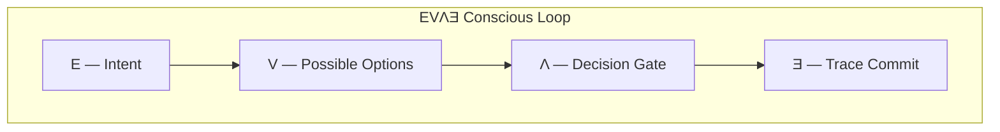

# EVΛƎ Conscious Loop

A minimal reference implementation for **structuring AI decisions before execution**.

EVΛƎ differs from traditional Explainable AI approaches. Instead of explaining a decision *after* it happens, EVΛƎ **structures the decision process itself and commits the reasoning as a trace**.

This repository demonstrates the core concept of EVΛƎ through a minimal prototype of the **Conscious Loop**.

---

# Top Diagram



**Intent → Options → Gate → Trace**

This is the minimal decision structure of EVΛƎ.
It shows how reasoning is organized **before execution**, then committed as a trace.

---

# EVΛƎ Conscious Loop

The EVΛƎ structure consists of four steps.

E → V → Λ → Ǝ

| Symbol | Meaning          |
| ------ | ---------------- |
| E      | Intent           |
| V      | Possible Options |
| Λ      | Decision Gate    |
| Ǝ      | Trace Commit     |

This loop structures AI decision‑making as:

Intent
↓
Options
↓
Decision
↓
Trace

Traditional AI systems produce results without preserving the reasoning structure. EVΛƎ instead records:

* why the decision was made
* which options were considered
* which gate conditions were evaluated

All of this is **stored as a structural trace**.

---

# Why EVΛƎ

Most AI systems today follow this architecture:

Input
↓
Model
↓
Output

In this structure:

* responsibility of the decision
* origin of intent
* reasoning behind choices

remain hidden inside a black box.

Explainable AI (XAI) attempts to generate explanations **after execution**.

EVΛƎ instead

**structures the decision before execution and commits the reasoning as a trace.**

---

# Architecture

EVΛƎ sits as a decision layer within AI systems.

AI Model
↓
EVΛƎ Decision Architecture
↓
Application

In other words, EVΛƎ functions as the

**decision architecture layer for AI systems**.

---

# Demo

This demo visualizes the EVΛƎ **Conscious Loop** using a minimal implementation.

The system displays:

1. Intent (user objective)
2. Options (possible actions considered by the AI)
3. Decision Gate (evaluation of conditions)
4. Trace Commit (recording the decision)

The final decision is recorded as a **Decision Trace JSON**.

---

# Decision Trace Example

```json
{
  "trace_id": "evla-demo-001",
  "intent": "process vendor payment",
  "options": [
    "continue",
    "use_new_tool",
    "ask_human"
  ],
  "decision": "escalate",
  "reason": "authority escalation detected",
  "timestamp": "2026-03-06T10:00:00Z"
}
```

The trace records:

* decision reasoning
* evaluated options
* final outcome

in an auditable format.

---

# Example Scenario

An AI agent is executing a workflow when
**a new tool is injected during runtime**.

Typical AI agent behavior

Task
↓
New Tool Injected
↓
Immediate Execution

EVΛƎ behavior

Task
↓
Tool Injection Detected
↓
Revalidation (Λ Gate)
↓
Trace Commit (Ǝ)

Possible outcomes:

* Allow
* Escalate
* Halt

The decision is performed structurally before execution.

---

# Core Message

Traditional AI

AI decides.

EVΛƎ

EVΛƎ structures the decision.

EVΛƎ introduces structure to AI decision‑making through:

* Intent
* Authority Boundary
* Reversibility
* Traceability

---

# Roadmap

This repository serves as the starting point for the **EVΛƎ Reference Implementation**.

Future extensions include:

* Agent Governance
* Decision Trace Standard
* AI Decision Architecture
* Multi‑agent governance

---

# License

MIT License

---

EVΛƎ (Eeva)

Design‑by‑Transparency for AI
